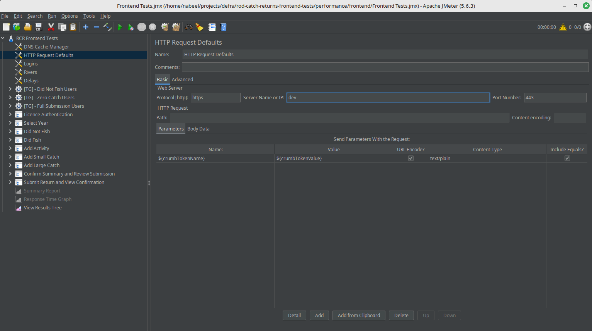

# Rod Catch Returns frontend performance tests

Performance tests for the Rod Catch Returns (RCR) frontend service.

## Running using JMeter

The performance tests use JMeter to run. You can run them using Docker (see Docker section below), but to make modifications locally, it is advised to install Java and [JMeter](https://jmeter.apache.org/). Run JMeter from this directory i.e.

```
cd /performance/frontend
```

### GUI

To bring up the JMeter GUI, if installed in the home directory in linux, it will be
```
~/apache-jmeter-5.6.3/bin/jmeter 
```

Once the GUI is loaded, File > Open > Frontend Tests.jmx



You can change the url it points to by changing "Server Name or IP"

To run, just press the green triangle (start button).

### Command line

To run using the command line (modify the location of where your JMeter is installed)

```
~/apache-jmeter-5.6.3/bin/jmeter -n -t Frontend\ Tests.jmx -l log.log -e -o output
```

This will run the tests and produce a report

## Docker

TBC
